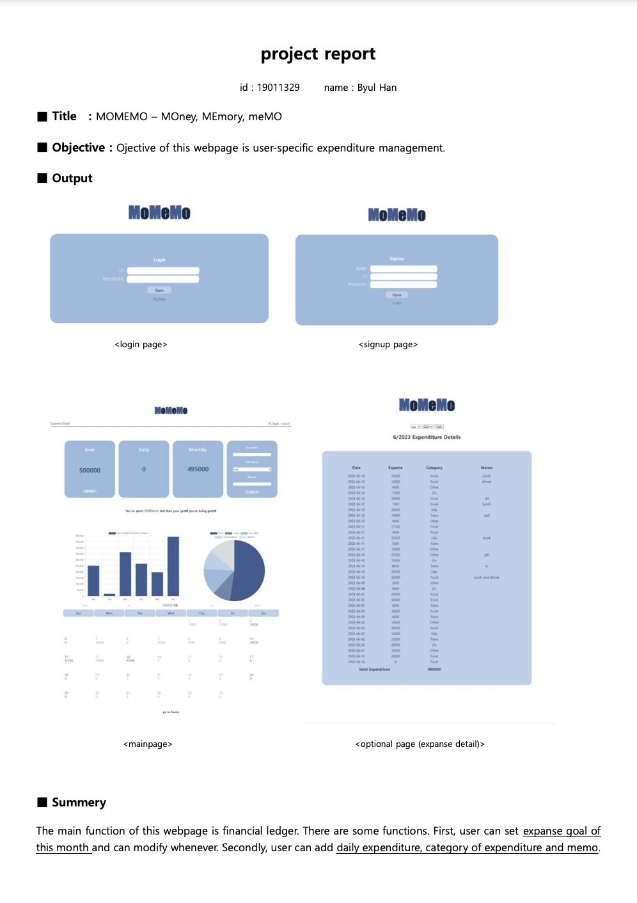
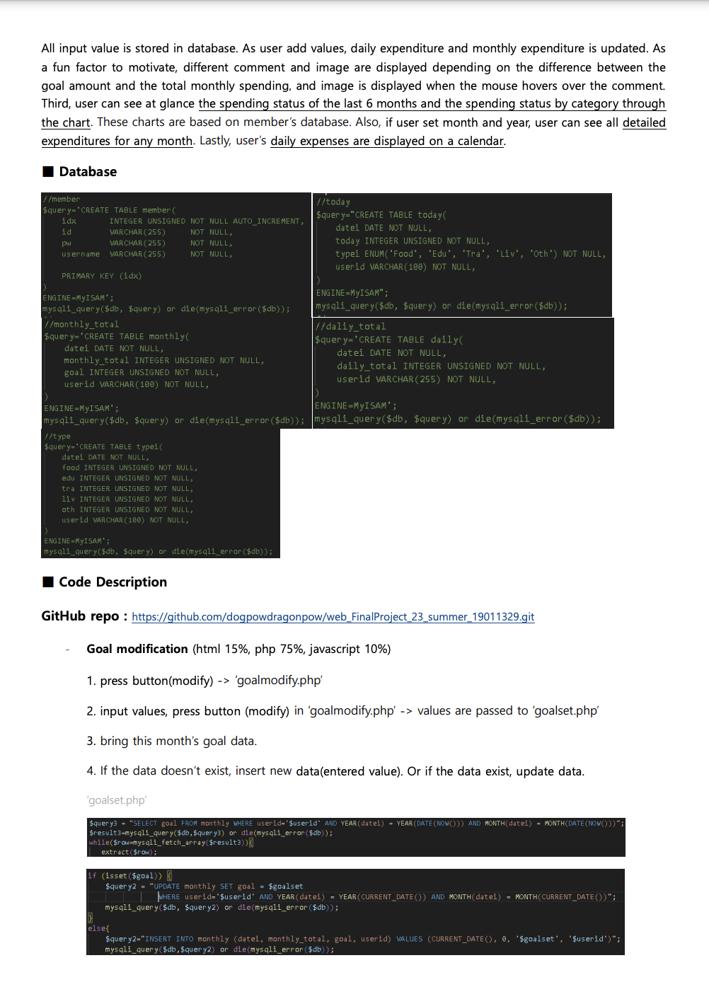
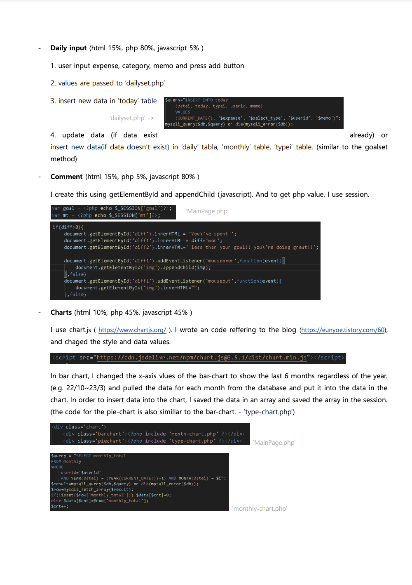
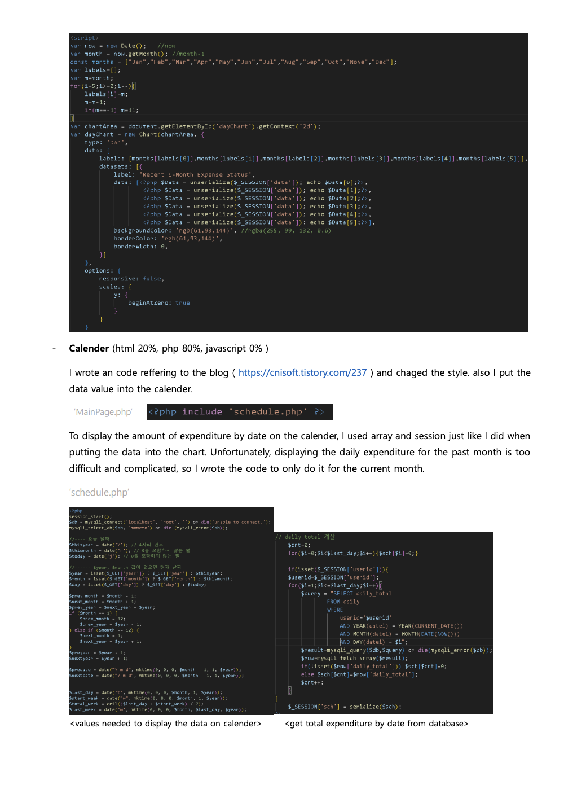
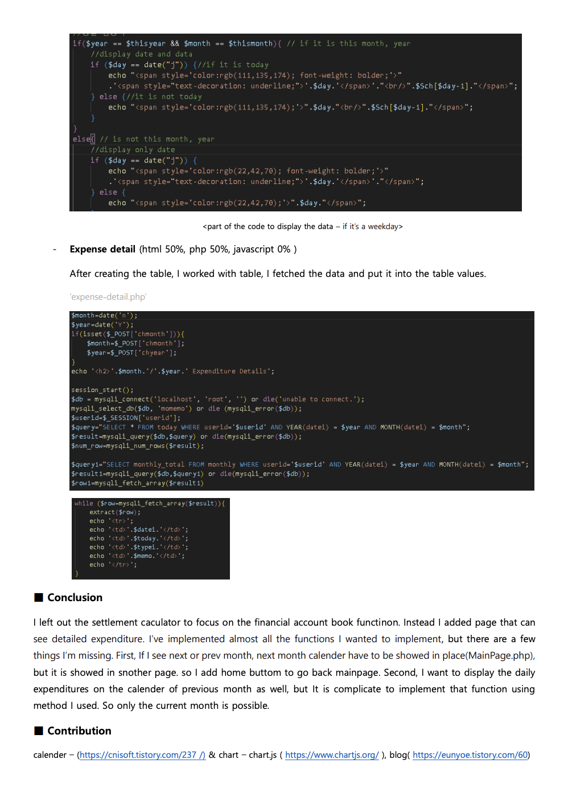

# web_FinalProject_23_summer_19011329
this is for Final project of web-programming class (23.summer term / joshi) 19011329 한별

### 개요📝
이 프로젝트의 가장 중요한 목적은 공부라고 생각했다.
html, javascript, css, mySQL, php를 내가 얼마나 공부하고 이해했는지 잘 보여줄 수 있는 주제를 선정하고 싶었고 그래서 가계부 웹사이트를 만들어보기로 했다.
덕분에 이 다섯가지 요소를 모두 골고루 공부하고 이해하고 적용시켜볼 수 있었다. 
가장 공부를 많이 한 부분은 data와 php, html과 php, js와 php를 연결시켜 사용하는 부분이었다.
개인 프로젝트이기때문에 모든 것을 혼자 해야했고 myAQL과 php는 처름 접해보는 것이였기 때문에 시간을 많이 소요해야했지만 값진 시간이었고 좋은 성적으로 보상을 받았다고 생각한다.

### 프로젝트 설명
#### MOMEMO : MOney, MEmory, meMO
차트와 달력 등을 이용해 총지출, 일별/월별 지출, 소비 종류별 지출 현황을 쉽게 파악할 수 있게 제작하였습니다.
- 회원가입 / 로그인 / 로그아웃
- 메인 페이지
  - 이번 달 목표 소비 금액
  - 이번 달 총 지출 금액
  - 오늘 지출 금액
  - 지출 입력란 (지출 금액, 소비 종류, 메모)
  - 최근 6개월 월별 지출 량 (bar chart)
  - 소비 종류별 지출 량 (circle chart)
  - 지출 캘린더
- 상세 지출 페이지 (expanse detail)
  - 지출 내역 (월 / 년 선택)

### Report
https://hungry-barracuda-23c.notion.site/Project4-MoMeMo-c7a5239132f446beb4b482ca445e0d95?pvs=4

  
  
  

  
  

